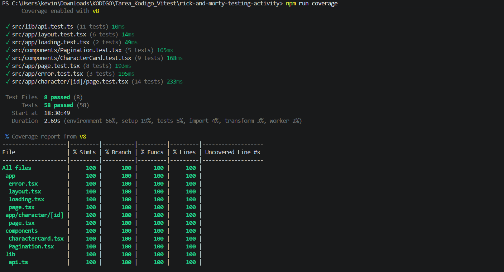

# 🧪 Pruebas Automatizadas con Vitest

Actividad práctica: **garantizar la calidad y estabilidad del software mediante una pirámide de pruebas automatizadas** sobre el proyecto Rick and Morty Explorer (Next.js + React).

## 📊 Reporte de cobertura

Resultado de ejecutar `npm run coverage` (`vitest run --coverage`):



| Métrica    | Cobertura | Mínimo requerido |
| ---------- | --------- | ---------------- |
| Statements | 100%      | 80%              |
| Branches   | 100%      | 80%              |
| Functions  | 100%      | 80%              |
| Lines      | 100%      | 80%              |

**Total: 8 archivos de prueba y 58 pruebas, todas exitosas.**

El reporte HTML completo está en la carpeta [`coverage/`](./coverage). Para verlo, abre `coverage/index.html` en el navegador.

## 🔺 Pirámide de pruebas

| Nivel                  | Qué se prueba                                                                    | Archivos                                                                                          |
| ---------------------- | -------------------------------------------------------------------------------- | ------------------------------------------------------------------------------------------------- |
| **Unitarias**          | Lógica de negocio y componentes de forma aislada                                 | `src/lib/api.test.ts`, `src/components/CharacterCard.test.tsx`, `src/components/Pagination.test.tsx` |
| **Integración**        | Páginas completas de la app trabajando con sus componentes (API simulada con mocks) | `src/app/page.test.tsx`, `src/app/character/[id]/page.test.tsx`, `src/app/layout.test.tsx`, `src/app/loading.test.tsx`, `src/app/error.test.tsx` |

### Detalle por archivo

| Archivo de prueba                    | Pruebas | Qué valida                                                                                  |
| ------------------------------------ | ------- | ------------------------------------------------------------------------------------------- |
| `api.test.ts`                        | 11      | URLs de las peticiones, manejo de errores y casos especiales de `getEpisodes`               |
| `CharacterCard.test.tsx`             | 9       | Datos mostrados, enlace al detalle y color según el estado del personaje                    |
| `Pagination.test.tsx`                | 5       | Botones activos y desactivados en primera, intermedia, última y única página               |
| `page.test.tsx`                      | 8       | Lista de personajes, lectura del parámetro `page`, paginación y errores de la API           |
| `character/[id]/page.test.tsx`       | 14      | Detalle del personaje, extracción de ids de episodios, formato de fecha y casos límite      |
| `layout.test.tsx`                    | 6       | Metadatos, encabezado, pie de página e idioma                                               |
| `loading.test.tsx`                   | 2       | Tarjetas esqueleto y animación de carga                                                     |
| `error.test.tsx`                     | 3       | Mensaje de error, registro en consola y botón "Try again"                                   |

## 🛠️ Herramientas de testing

- **[Vitest](https://vitest.dev/)**: framework de pruebas.
- **@vitest/coverage-v8**: reportes de cobertura (consola y HTML).
- **[React Testing Library](https://testing-library.com/docs/react-testing-library/intro/)** y **user-event**: renderizado de componentes y simulación de acciones del usuario.
- **jest-dom**: matchers adicionales como `toBeInTheDocument()`.
- **jsdom**: entorno de navegador simulado.

La configuración está en [`vitest.config.ts`](./vitest.config.ts), con un umbral mínimo de **80%** en las cuatro métricas. Si la cobertura baja de ese valor, el comando falla.

## ▶️ Cómo ejecutar las pruebas

```bash
# Instalar dependencias
npm install

# Pruebas en modo observador
npm test

# Pruebas una sola vez
npm run test:run

# Pruebas con reporte de cobertura (consola + HTML en coverage/)
npm run coverage
```

-------------------------------------------------------------------------------------------------------------------------------

# Rick and Morty Explorer 🧪

Una aplicación web moderna para explorar el universo de Rick and Morty, construida con Next.js 15, React 19 y Tailwind CSS v4.

## 🚀 Características

- **Exploración de Personajes**: Navega a través de todos los personajes de la serie con una interfaz de cuadrícula responsive.
- **Detalle de Personaje**: Información detallada de cada personaje, incluyendo origen, ubicación y episodios.
- **Paginación**: Navegación fluida entre páginas de resultados.
- **Diseño Responsive**: Optimizado para móviles, tablets y escritorio.
- **Modo Oscuro**: Interfaz oscura por defecto con estética acorde a la serie.
- **Server-Side Rendering (SSR)**: Carga rápida y SEO optimizado gracias a Next.js App Router.

## 🛠️ Tecnologías

- **Framework**: [Next.js 15](https://nextjs.org/) (App Router)
- **Biblioteca UI**: [React 19](https://react.dev/)
- **Estilos**: [Tailwind CSS v4](https://tailwindcss.com/)
- **API**: [The Rick and Morty API](https://rickandmortyapi.com/)
- **Tipado**: TypeScript

## 📦 Instalación y Ejecución Local

1.  **Clonar el repositorio** (o descargar el código):
    ```bash
    git clone <tu-repositorio>
    cd my-app
    ```

2.  **Instalar dependencias**:
    ```bash
    npm install
    # o
    pnpm install
    # o
    yarn install
    ```

3.  **Ejecutar el servidor de desarrollo**:
    ```bash
    npm run dev
    # o
    pnpm dev
    # o
    yarn dev
    ```

4.  Abrir [http://localhost:3000](http://localhost:3000) en tu navegador.

## 🚀 Despliegue

La forma más sencilla de desplegar esta aplicación es utilizando [Vercel](https://vercel.com/new).

1.  Sube tu código a un repositorio de GitHub, GitLab o Bitbucket.
2.  Importa el proyecto en Vercel.
3.  Vercel detectará automáticamente que es un proyecto Next.js.
4.  Haz clic en **Deploy**.

## 📂 Estructura del Proyecto

- `src/app`: Rutas de la aplicación (App Router).
  - `page.tsx`: Página principal (lista de personajes).
  - `character/[id]/page.tsx`: Página de detalle de personaje.
  - `loading.tsx` / `error.tsx`: Estados de carga y error.
  - `layout.tsx`: Layout principal con Header y Footer.
- `src/components`: Componentes reutilizables (`CharacterCard`, `Pagination`).
- `src/lib`: Lógica de cliente API (`api.ts`).
- `src/types`: Definiciones de tipos TypeScript (`rickandmorty.ts`).

## ✅ Requisitos Cumplidos

- [x] Consumo de API de Personajes.
- [x] Vista de cuadrícula con imagen, nombre, estado y especie.
- [x] Paginación.
- [x] Vista de detalle con información completa.
- [x] Lista de episodios en la vista de detalle.
- [x] Enrutamiento cliente-servidor (Next.js).
- [x] Diseño Responsive.
- [x] Loading states y manejo de errores.
